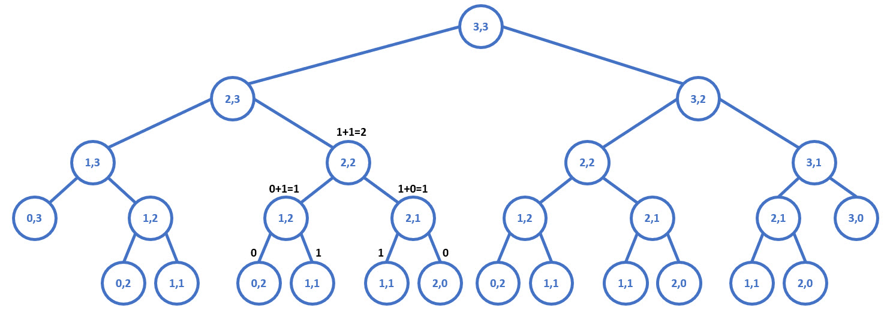
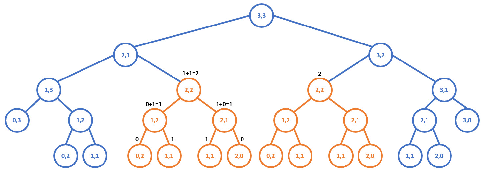
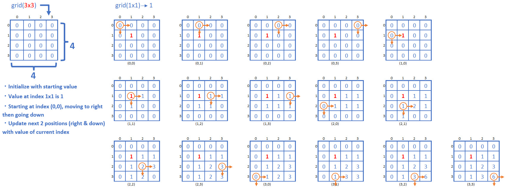

# Dynamic Programming
This is a summary of the course [**Dyanamic Programming - Learn to Solve Algorithmic Problems & Coding Challenges**](https://youtu.be/oBt53YbR9Kk)
> Learn how to use Dynamic Programming in this course for beginners. It can help you solve complex programming problems, such as those often seen in programming interview questions about data structures and algorithms.
> 
> This course was developed by Alvin Zablan from Coderbyte. Coderbyte is one of the top websites for technical interview prep and coding challenges.

### Memorization Recipe
- Make it work.
  - Visualize the problem as a tree.
  - Implement the tree using recursion.
  - Test it.

- Make it efficient.
  - Add a memo object.
  - Add a base case to return memo values.
  - Store return values into the memo.

### Tabulation Recipe
- Visualize the problem as a table.
- Determine the size of the table based on the inputs.
- Initialize the table with default values.
- Seed the trivial answer into the table.
- Iterate through the table.
- Fill further positions based on the current position.

### Problems
- [Fibonacci](./fibonacci.ipynb)
- [Grid Traveler](./grid_traveler.ipynb)
- [Can Sum](./can_sum.ipynb)
- [How Sum](./how_sum.ipynb)
- [Best Sum](./best_sum.ipynb)
- [Can Construct](./can_construct.ipynb)
- [Count Construct](./count_construct.ipynb)
- [All Constructs](./all_construct.ipynb)
